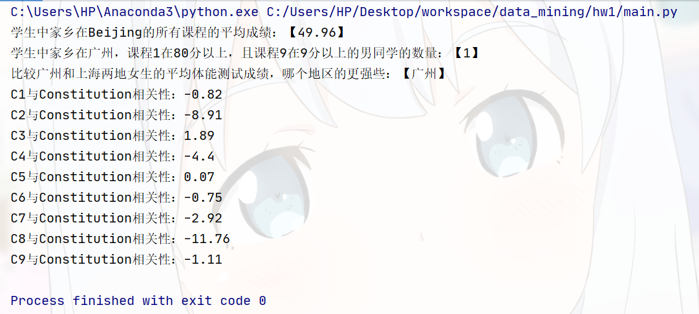

# 机器学习与数据挖掘

## 项目名称：机器学习与数据挖掘大作业

## 项目组成

### 项目的人员组成与分工

**组长：苏林斌 （1806300180）**

**组员**

**欧阳宇航 （1806300189）**

**陈名耀 （1806300193）**


### 项目目录结构说明

```markdown
|-- data_mining
    |-- .gitignore
    |-- install.sh // 环境安装脚本
    |-- README.md // 作业文档说明
    |-- requirements.txt // 依赖列表
    |-- .idea
    |   |-- ...
    |-- hw1 // 实验一
    |   |-- main.py // 主程序
    |   |-- data // 存放数据的文件夹
    |       |-- data01.xlsx // 模拟数据库数据的xlsx文件
    |       |-- data02.txt // txt文本数据文件
    |       |-- merged.csv // 经过数据清洗合并后生成的csv文件
    |-- hw2 // 实验二
    |   |-- main.py // 主程序
    |   |-- data // 存放数据的文件夹
    |       |-- merged.csv // 使用的数据
    |       |-- result.txt // task5实验结果
    |-- hw3 // 实验三
    |-- README.assets // 存放README文档相关资源的目录
        |-- ...
```


## 作业选题

- **实验一：《多源数据集成、清洗和统计》**
- **实验二：《数据统计和可视化》**
- **实验三：《k-means聚类算法》**


## 运行环境

三次实验都是使用python语言完成的

python环境：**python3.6+**

所需依赖在requirements.txt中

主要使用的工具包：

1. pandas
2. numpy
3. matplotlib
4. seaborn

### Installation

#### 0. python安装

下载网址：  [https://www.python.org/downloads/](https://www.python.org/downloads/)

#### 1. 获取代码

```bash
git clone https://github.com/su614820984/data_mining
```

#### 2. 创建虚拟环境

python -m venv env

#### 3. py环境切换

windows

```bash
cd env/Scripts
activate.bat
cd ../../
```

linux

```bash
source env/bin/activate
```

#### 4. 依赖安装

```bash
pip install -r requirements.txt
```


#### * 可以直接使用install.sh脚本安装依赖

已经安装了python3.6以上版本

windows可以在git自带的bash命令行中执行脚本

```bash
./install.sh # 运行环境安装脚本
```


## 程序运行结果

### 如何运行

```bash
python hw1/main.py # 实验一程序
python hw2/main.py # 实验二程序
python hw3/main.py # 实验三程序
```

### 实验一



### 实验二

成绩1和体测成绩的散点图

x轴：成绩1

y轴：体测成绩


成绩1的直方图


学生成绩的相关矩阵


### 实验三


## 难题与解决


## 总结
