# 机器学习与数据挖掘

## 项目名称：机器学习与数据挖掘大作业

## 项目组成

### 项目的人员组成与分工

**组长：苏林斌 （1806300180）**

>  负责部分：文档编写，实验三

**组员**

**欧阳宇航 （1806300189）**

> 负责部分：

**陈名耀 （1806300193）**

> 负责部分：


### 项目目录结构说明

```markdown
|-- data_mining
    |-- .gitignore
    |-- install.sh // 环境安装脚本
    |-- README.md // 作业文档说明
    |-- requirements.txt // 依赖列表
    |-- .idea
    |   |-- ...
    |-- hw1 // 实验一
    |   |-- main.py // 主程序
    |   |-- data // 存放数据的文件夹
    |       |-- data01.xlsx // 模拟数据库数据的xlsx文件
    |       |-- data02.txt // txt文本数据文件
    |       |-- merged.csv // 经过数据清洗合并后生成的csv文件
    |-- hw2 // 实验二
    |   |-- main.py // 主程序
    |   |-- data // 存放数据的文件夹
    |       |-- merged.csv // 使用的数据
    |       |-- result.txt // task5实验结果
    |       |-- z_score.txt // z-score归一化的数据
    |-- hw3 // 实验三
    |   |-- main.py // 主程序
    |   |-- data // 存放数据的文件夹
    |       |-- test.txt // 测试用的数据，我用txt文本存下来了
    |       |-- z_score.txt // 实验二中得到的z-score归一化的数据
    |-- README.assets // 存放README文档相关资源的目录
        |-- ...
```


## 作业选题

- **实验一：《多源数据集成、清洗和统计》**
- **实验二：《数据统计和可视化》**
- **实验三：《k-means聚类算法》**


## 运行环境

三次实验都是使用python语言完成的

python环境：**python3.6+**

所需依赖在requirements.txt中

主要使用的工具包：

1. pandas
2. numpy
3. matplotlib
4. seaborn

### Installation

#### 0. python安装

下载网址：  [https://www.python.org/downloads/](https://www.python.org/downloads/)

#### 1. 获取代码

```bash
git clone https://github.com/su614820984/data_mining
```

#### 2. 创建虚拟环境

python -m venv env

#### 3. py环境切换

windows

```bash
cd env/Scripts
activate.bat
cd ../../
```

linux

```bash
source env/bin/activate
```

#### 4. 依赖安装

```bash
pip install -r requirements.txt
```


#### * 可以直接使用install.sh脚本安装依赖

已经安装了python3.6以上版本

windows可以在git自带的bash命令行中执行脚本

```bash
./install.sh # 运行环境安装脚本
```


## 程序运行结果

### 如何运行

```bash
python hw1/main.py # 实验一程序
python hw2/main.py # 实验二程序
python hw3/main.py # 实验三程序
```

### 实验一

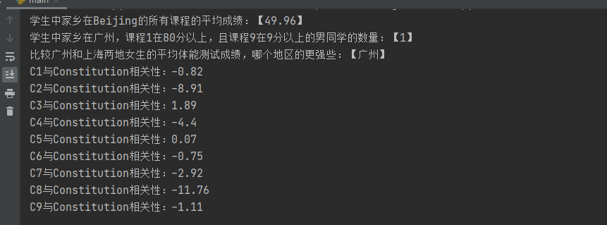

### 实验二

成绩1和体测成绩的散点图

x轴：成绩1

y轴：体测成绩

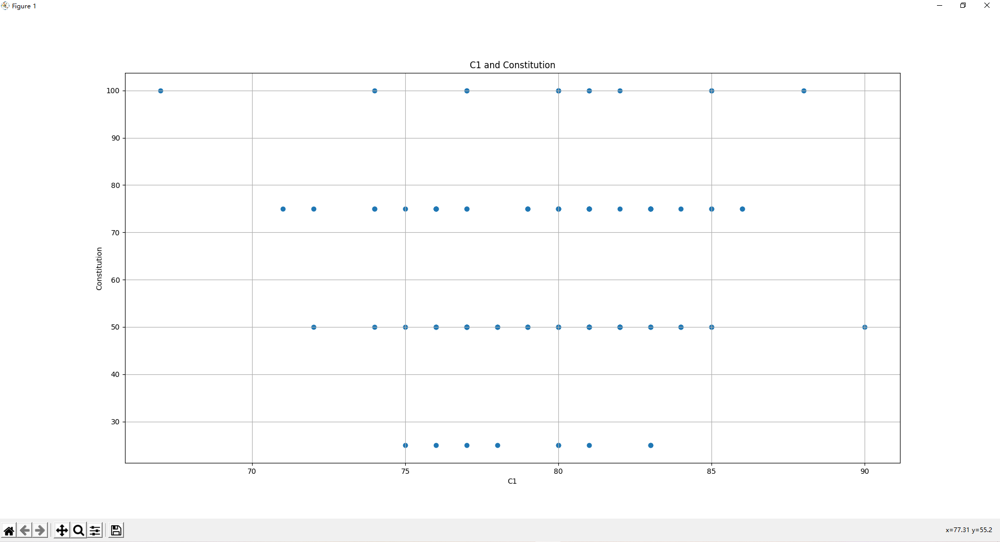


成绩1的直方图

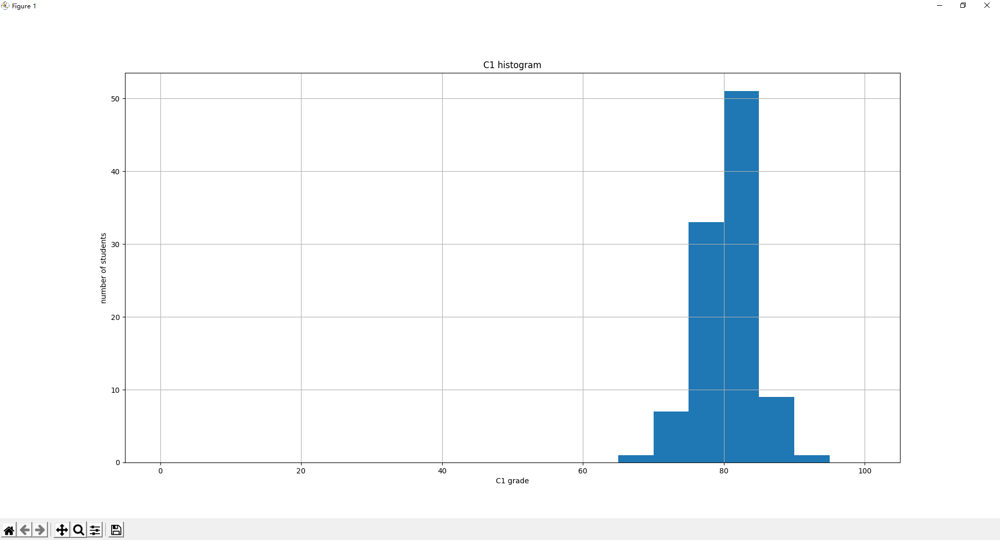


学生成绩的相关矩阵

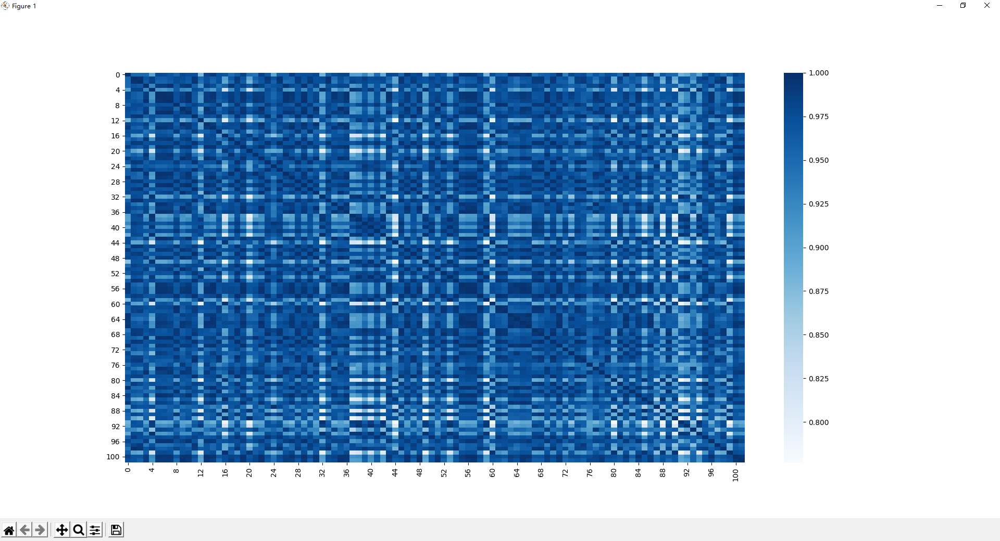


### 实验三

1. z-score归一化的成绩数据聚类结果（没有进行降维，绘图时是选的前两个属性作为xy轴的）

    2类

    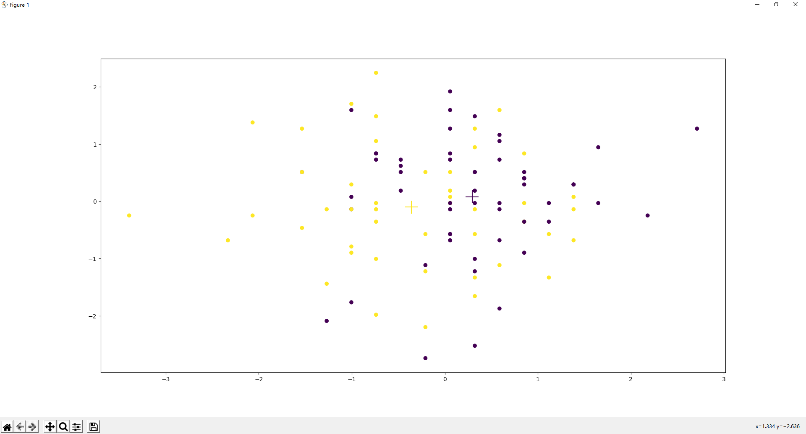

    3类

    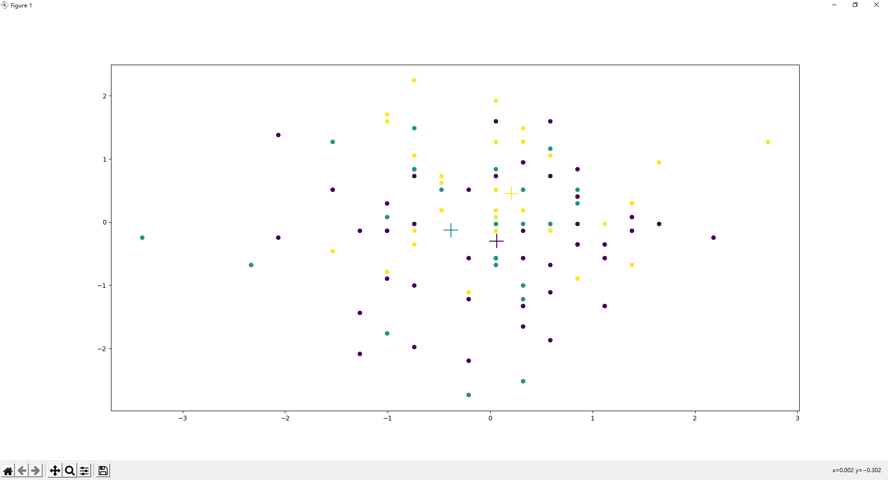

    4类

    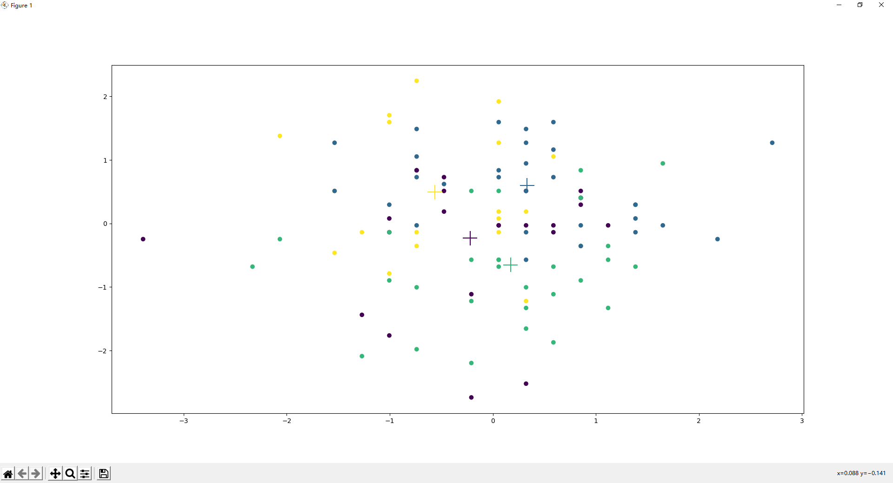

    5类

    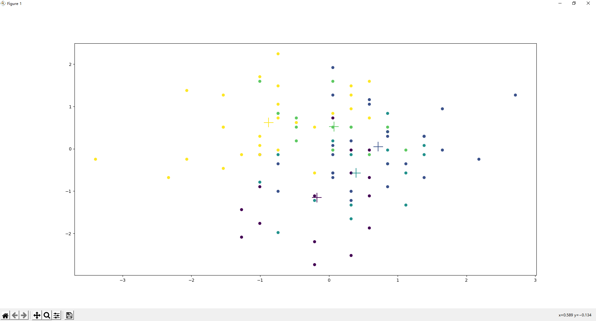

    

2. 

    2类

    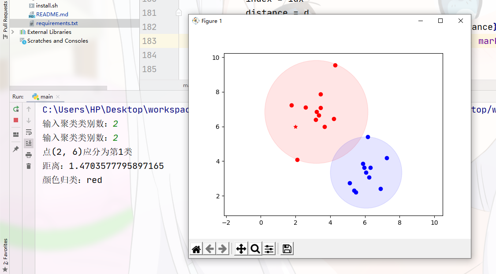

    3类

    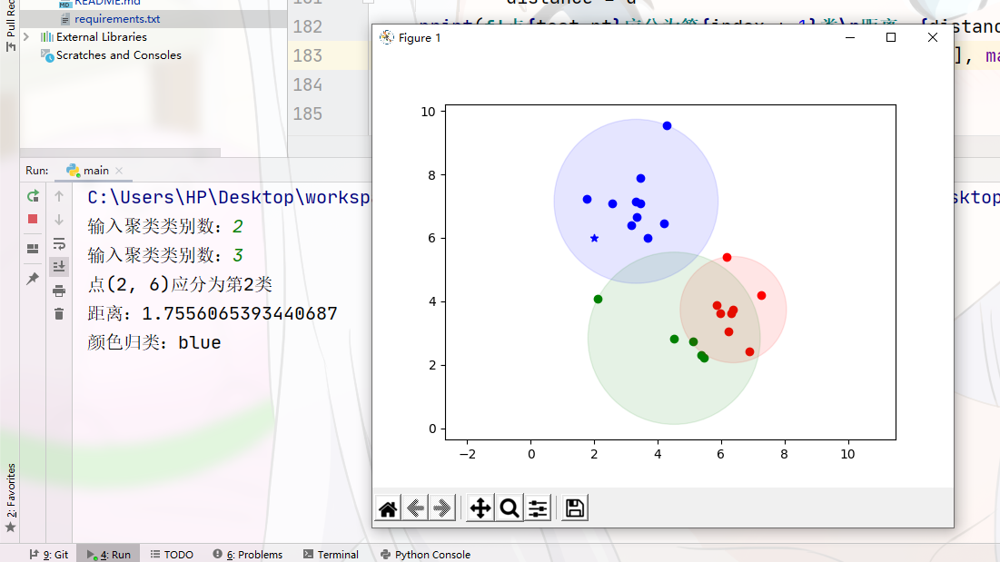

    4类

    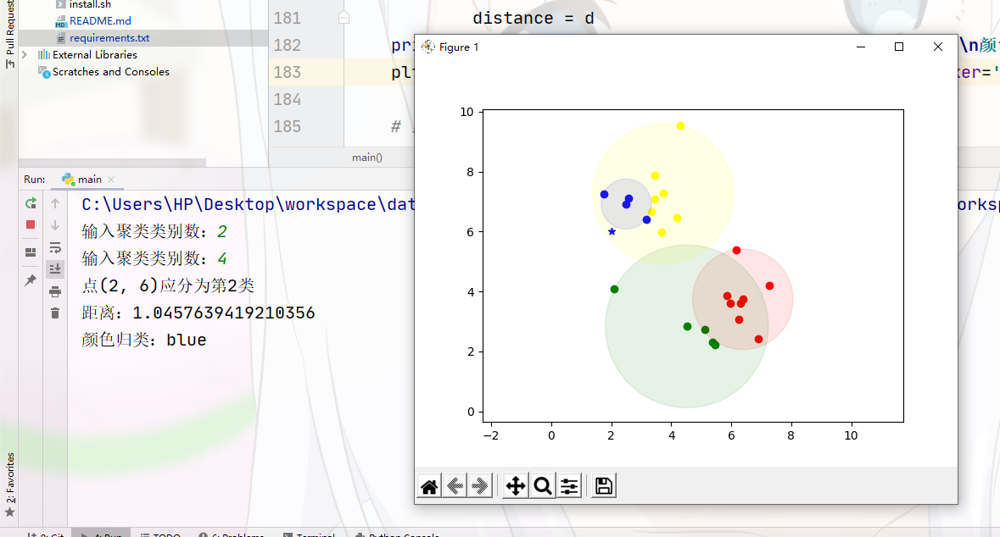

    5类

    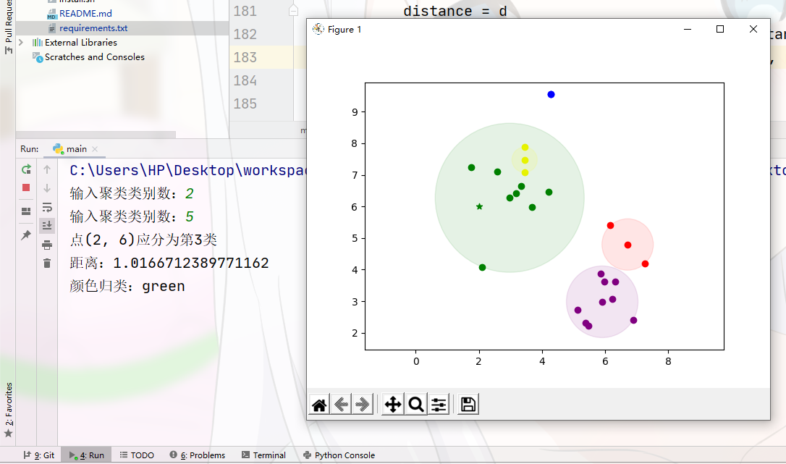

## 难题与解决

### 实验一

1. 一开始对于缺失值想着简单通过列均值来填补空缺，但是后面仔细看两个数据集才发现，有些xlsx中有缺失的数据在txt中是有记录的，txt中缺失值有些也可以从xlsx中查找并补全，所以就更改了代码，用相互比对的形式来互相填补缺失值，而不是简单的使用均值填空
2. 这个问题也是到要合并数据的时候才发现的，数据里边居然有重复的行，这是一开始没有发现，后面添加去重功能解决了
3. 一开始看数据，以为xlsx中的gender是以【'male','female'】形式记录的，而txt用的【'boy','girl'】，所以我将xlsx中的gender属性值映射为txt中所用的记录形式，但是后面仔细看打印出来的数据的时候发现还是有male和female形式的记录，后面查了源数据发现两个数据源本身对于这列属性的记录根本就是串着的，最后对两个数据源的数据都做了处理把这个问题解决了
4. 对于计算部分根据公式可以算出，就是刚开始写的时候偶尔会出错

### 实验二

1. 实验的第一个问题是需要将体能成绩作为y轴绘制散点图的，但是体能成绩是非数值型的数据，至少要先转化为数值型才可以绘图，参照其他列属性的值以及百度的结果，将体能成绩映射到【25，50，75，100】四个离散的数值来进行绘图，最终的散点图看起来非常别扭，不知道是不是处理方式不对，感觉这里有待改进
2. 一开始不理解100x100的相关矩阵的意思，结果算出来不对劲，通过百度和老师给的ppt了解公式后正确计算出来了
3. 因为不是很熟悉python的绘图，所以绘制矩阵的时候花了一点时间，最后就是通过调用seaborn内置的函数方法完成绘图的

### 实验三

1. 对实验二中的z-score归一化的成绩数据进行测试，观察聚类为2类，3类，4类，5类的结果，观察得出什么结论？

    类别增多，类中心点更分散，分类更细致

2. （2，6）应聚类的类别在截图中可查看

3. 对于归一化后的数据，我没有用PCA降维方法进行降维，或许降为2维后，散点图的解释性更高，对比结果可能更直观，感觉维度越高，解释性越差

## 总结

### 实验一

经过本次实验学习如何数据清洗，巩固了相关性的计算方法

### 实验二

学习到如何计算样本的相关矩阵并可视化出来，使得结果更加的直观

### 实验三

学习如何绘制散点图，以及kmeans算法的原理